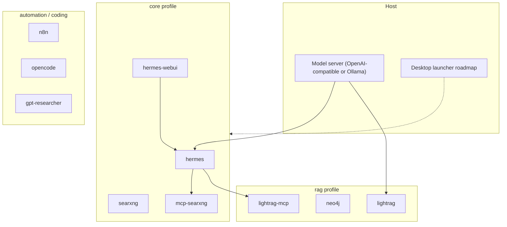

# Local Agent Stack

A Docker Compose stack that runs a **robust local AI agent on your machine** — private by default, no cloud required for inference. Curated integrations for chat, web search, knowledge graphs, workflow automation, and coding agents. A desktop launcher that manages this stack for non-technical users is on the roadmap.

## Quick start

```bash
./scripts/setup.sh          # secrets, data/, COMPOSE_PROFILES=core
make doctor                 # Docker, ports, model server from inside a container
# Start a host model server (OpenAI-compatible or Ollama) — or use --ollama
make up
# First Hermes boot only:
docker compose run --rm hermes setup && make up
```

Open **[http://localhost:8787](http://localhost:8787)** (Hermes WebUI). Dashboard: [http://localhost:9119](http://localhost:9119).

Zero-config demo (CPU Ollama in Docker):

```bash
./scripts/setup.sh --ollama
make up
docker compose run --rm ollama-pull
```

On Apple Silicon, Docker cannot use the GPU — prefer a **host** model server (LM Studio, host Ollama, llama.cpp, …) for speed; the `ollama` profile is the self-contained demo path.

## Architecture



## Profiles

| Profile | What you get |
|---|---|
| **`core`** (default) | Hermes agent, Hermes WebUI, SearXNG, mcp-searxng |
| **`rag`** | LightRAG + Neo4j knowledge graph + MCP sidecar |
| **`automation`** | n8n + Postgres + GPT Researcher |
| **`coding`** | OpenCode AI coding agent |
| **`ollama`** | Bundled Ollama + demo model pull |

Examples:

```bash
./scripts/setup.sh --rag --automation --coding
# or edit .env:
# COMPOSE_PROFILES=core,rag,automation,coding
```

## Security model (why this isn't just a compose dump)

- **Localhost binds** for SearXNG, GPT Researcher, Hermes dashboard/API/WebUI — not LAN-exposed by default.
- **Hermes LightRAG MCP allowlist:** unattended API sessions get five read-oriented tools out of seventeen; the bootstrap **drops unfiltered clone duplicates** so a `--clone`d profile cannot bypass the allowlist.
- **Per-profile API keys** for Hermes `api-server` vs `browser` gateways — sharing one key fails closed.
- **OpenCode secret shadowing:** mount `compose/opencode/blank` over project `.env` files via gitignored `docker-compose.override.yml`.
- Setup writes secrets into **gitignored** overlays (`searxng/settings.local.yml`, Hermes `*.env`), not tracked templates.

See [SECURITY.md](SECURITY.md).

## Prerequisites

- Docker Compose v2 (Linux, macOS, Windows/WSL2)
- A model server: any OpenAI-compatible API on the host (LM Studio, llama.cpp, vLLM, …), host Ollama, or the `ollama` profile

> **#1 gotcha:** inside a container, `localhost` is the container. Reach the host as `host.docker.internal`. The host server must listen beyond localhost (LM Studio: **Serve on Local Network**; Ollama: `OLLAMA_HOST=0.0.0.0`).

**Recommended:** 16 GB RAM when running a local 7–35B model beside the stack.

## Docs

| Doc | Topic |
|---|---|
| [docs/](docs/README.md) | Per-service guides |
| [Hermes](docs/hermes.md) | Agent gateway, skills, MCP |
| [Hermes WebUI](docs/hermes-webui.md) | Chat UI + lean gateway mode |
| [LightRAG / rag](docs/n8n.md) | Workflows that call the stack (with `automation`) |
| [Writing voice](docs/writing-voice.md) | Style calibration skill |
| [Releasing](docs/releasing.md) | Thematic commit playbook for the first public history |

## Commands

```bash
make setup / ./scripts/setup.sh
make doctor
make up / make down / make ps
make logs
make hermes-upgrade AGENT=v… WEBUI=…
make clean   # destroys volumes + data/
```

## Roadmap

- Desktop app that launches and manages this Docker setup for non-technical users
- Harden first-run UX (`make doctor` coverage, guided model install)

## License

MIT — see [LICENSE](LICENSE).
