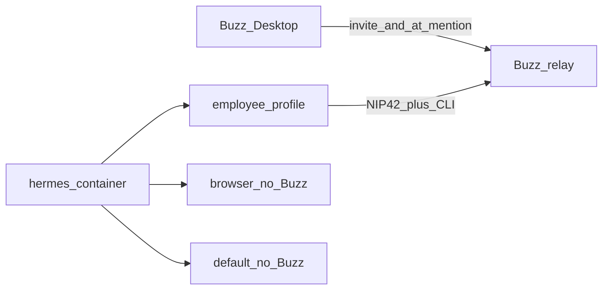

[← Back to README](../README.md)

# Buzz messaging

Hermes joins a [Buzz](https://buzz.xyz) community as a normal member (Nostr keypair) via the **native gateway platform** (Hermes docs path ③). There is no compose sidecar — unlike [Signal](signal.md), Buzz talks to your community relay over HTTPS/WSS from inside the `hermes` container.

Employee “bots” (Software Engineer, UI/UX Designer, …) are **operator-local Hermes profiles** under `data/hermes/profiles/<name>/`. That tree is gitignored. This repo only ships plumbing and helpers.

## Architecture



| Piece | Role |
|---|---|
| **Buzz Desktop** | Human client; invite agent pubkeys; `@mention` employees |
| **Community relay** | Membership + channels (hosted on buzz.xyz or self-hosted) |
| **`buzz` CLI** | Outbound sends from Hermes; installed into `data/hermes/.local/bin` |
| **Employee Hermes profile** | One process per profile (s6); own `SOUL.md`, memory, `BUZZ_PRIVATE_KEY` |
| **`browser` / `api-server`** | Buzz adapter forced **off** (identity lock + stack roles) |

Official Hermes overview: [Buzz Integration](https://hermes-agent.nousresearch.com/docs/integrations/buzz) · [Messaging → Buzz](https://hermes-agent.nousresearch.com/docs/user-guide/messaging/buzz).

## Quick start

### Local Buzz (recommended)

```bash
# 1) Clone/setup Buzz, wire .env, start relay, install Hermes buzz CLI
make bootstrap-buzz

# 2) Open Buzz Desktop → Local Dev (ws://localhost:3000)

# 3) Create an employee (auto keygen + relay ACL + join channel `general`)
make hermes-buzz-employee PROFILE=software-engineer DISPLAY_NAME="Software Engineer"

# 4) Recreate Hermes so s6 picks up the new gateway
docker compose up -d --force-recreate hermes

# 5) @Software Engineer in Buzz
```

`bootstrap-buzz` defaults `BUZZ_LOCAL_DIR_PATH` to `~/src/buzz` when unset, runs upstream `just setup` with Hermit’s `bin/` on `PATH` (so `lefthook` resolves), then `make buzz-relay-start` and `make buzz-cli-install`.

Optional root `.env` knobs:

| Var | Purpose |
|---|---|
| `BUZZ_DEFAULT_CHANNEL` | Channel name or UUID to auto-join (default `general`) |
| `BUZZ_OPERATOR_PRIVATE_KEY` | Human identity for private-channel `add-member` fallback |

### Hosted community

```bash
# In root .env
# BUZZ_RELAY_URL=https://mycommunity.communities.buzz.xyz

make buzz-cli-install
make hermes-buzz-employee PROFILE=software-engineer DISPLAY_NAME="Software Engineer"
# Invite the printed pubkey in Desktop → Invites / Relay access
docker compose up -d --force-recreate hermes
```

Toggle without creating profiles:

```bash
HERMES_BUZZ_ENABLED=1
HERMES_BUZZ_PROFILES=software-engineer,ui-ux-designer
BUZZ_RELAY_URL=https://…
make ensure-local
```

`sync-buzz-profile.sh` seeds existing profiles only; missing names are warnings, not creates.

## Where env vars live

| File | Purpose |
|---|---|
| Root `.env` | `HERMES_BUZZ_ENABLED`, `HERMES_BUZZ_PROFILES`, `BUZZ_RELAY_URL`, optional `BUZZ_CLI_VERSION`, `BUZZ_LOCAL_DIR_PATH`, `BUZZ_DEFAULT_CHANNEL`, `BUZZ_OPERATOR_PRIVATE_KEY` |
| `data/hermes/profiles/<name>/.env` | Per-employee `BUZZ_PRIVATE_KEY` / `BUZZ_PUBLIC_KEY`, seeded `BUZZ_RELAY_URL` / `BUZZ_CLI_PATH` |

Do **not** put Buzz secrets in `compose/hermes/api-server.env` or `browser.env`.

## Buzz CLI

Official Hermes images do not bake the CLI. Install into the persistent volume:

```bash
make buzz-cli-install
# → data/hermes/.local/bin/buzz  (PATH: /opt/data/.local/bin inside hermes)
```

The script extracts `usr/bin/buzz` from a pinned Desktop `.deb` when available, otherwise builds `buzz-cli` in a one-shot Rust container. Override with `BUZZ_CLI_VERSION`, `BUZZ_CLI_METHOD=deb|cargo|auto`, or `BUZZ_CLI_DEB_ARCH`.

Refuse GUI launcher wrappers: the real CLI is a large ELF binary, not a tiny shell script.

## Local relay (`just relay`)

Prefer **`make bootstrap-buzz`** once — it clones (if needed), runs Buzz `just setup`, writes `BUZZ_LOCAL_DIR_PATH` / `BUZZ_RELAY_URL`, starts the relay, and installs the Hermes CLI.

To manage an existing checkout without re-running setup:

```bash
# In root .env
BUZZ_LOCAL_DIR_PATH=~/src/buzz   # checkout that has a Justfile with `relay`
BUZZ_RELAY_URL=ws://localhost:3000   # match whatever just relay binds

make buzz-relay-start    # nohup just relay; does not block the shell
make buzz-relay-status
make buzz-relay-logs     # tail data/hermes/.cache/buzz-relay/relay.log
make buzz-relay-stop
```

Requires [`just`](https://github.com/casey/just) on your PATH. Pid + logs live under `data/hermes/.cache/buzz-relay/` (gitignored). Hermes still talks to `BUZZ_RELAY_URL` from inside Docker. Keep the **same hostname as Desktop** (usually `ws://localhost:3000`) so you stay on the same Buzz community — communities are keyed by host. This stack starts a small localhost→`host.docker.internal` TCP proxy in the hermes container (`06-buzz-localhost-proxy`) so `localhost:3000` inside Docker reaches the host relay.

**Closed membership / Desktop Invites:** Local Dev open relays do not advertise NIP-43, so **Settings → Invites** stays hidden. To enable Invites, configure closed membership + owner pubkey in the Buzz checkout `.env` manually, then restart the relay. Path ③ automation uses `buzz-admin add-member` + channel join instead.

### `buzz-admin` (same checkout)

Operator membership/key helpers from the Buzz repo, without `cd`ing there:

```bash
make buzz-admin generate-key
make buzz-admin list-members
make buzz-admin -- add-member --pubkey npub1…
# Make needs `--` before dashed flags, or use:
#   make buzz-admin ARGS='add-member --pubkey npub1…'
# or: ./scripts/buzz-admin.sh add-member --pubkey <hex>
```

Uses `BUZZ_LOCAL_DIR_PATH`, prefers `target/release/buzz-admin` (then debug), else `cargo run -p buzz-admin`. Loads the Buzz checkout’s `.env` when present (`DATABASE_URL`, `REDIS_URL`, `BUZZ_RELAY_PRIVATE_KEY` for member commands). Hosted `*.communities.buzz.xyz` communities usually use Desktop **Settings → Invites** instead.

**Local Dev / open relay (no Settings → Invites):** Desktop only shows **Invites** when the relay advertises **NIP-43** and your identity is owner/admin on the membership snapshot. A typical `just relay` Local Dev setup does **not** advertise NIP-43 (`supported_nips` lacks `43`), so the Invites section is hidden on purpose — not a missing menu item.

For path ③ on that open local relay:

1. Keep Desktop on the same URL as `RELAY_URL` / `BUZZ_RELAY_URL` (e.g. `ws://localhost:3000`).
2. Prefer automation: `make hermes-buzz-employee PROFILE=…` (keygen + `buzz-admin add-member` + join `BUZZ_DEFAULT_CHANNEL`).
3. Manual fallback — add the agent with the **buzz CLI as your human identity**:

```bash
# Use your Desktop account nsec (Identity → export) — never commit it
export BUZZ_RELAY_URL=ws://localhost:3000
export BUZZ_PRIVATE_KEY=nsec1…   # or hex — your human key
docker compose exec -e BUZZ_RELAY_URL -e BUZZ_PRIVATE_KEY hermes \
  buzz channels add-member --channel <channel-uuid> --pubkey <agent-hex-pubkey> --role member
```

4. Recreate Hermes so the employee gateway connects; set a display name if needed (`buzz users set-profile` as the agent).

Optional: to get Desktop **Invites**, run a **closed** relay (`BUZZ_REQUIRE_RELAY_MEMBERSHIP=true`, `RELAY_OWNER_PUBKEY=<your hex pubkey>`, stable `BUZZ_RELAY_PRIVATE_KEY`), restart the relay so NIP-43 is advertised, then Invites appears for the owner.

## Connecting from Buzz Desktop

Path ③ does **not** use Settings → Agents (that is Desktop-managed Hermes). Instead:

1. Create the employee with `make hermes-buzz-employee` (or mint a dedicated key yourself — not your human identity; not shared with Desktop ACP).
2. On open Local Dev, channel membership is handled by the employee helper (or `buzz channels add-member` as your human identity). On NIP-43 closed relays, use Desktop **Settings → Invites**.
3. Set display name/avatar so the member appears as “Software Engineer”, not a raw npub.
4. With Hermes gateway running, `@mention` the employee in a channel (or DM).

Do not run Buzz Desktop ACP / managed Hermes on the **same** key as a gateway profile — duplicate replies.

## Multiple employees

One Buzz employee = one Hermes profile = one Nostr key.

```bash
make hermes-buzz-employee PROFILE=software-engineer DISPLAY_NAME="Software Engineer"
make hermes-buzz-employee PROFILE=ui-ux-designer DISPLAY_NAME="UI/UX Designer"
docker compose up -d --force-recreate hermes
```

Each profile gets its own gateway process (this stack’s default s6 layout). Keep `require_mention: true` in multi-agent rooms (sync writes recommended defaults).

Never put the same `BUZZ_PRIVATE_KEY` on two profiles.

## Disable

```bash
# In .env
HERMES_BUZZ_ENABLED=0
make ensure-local
```

Employee profile directories and private keys are left in place under `data/hermes/`.

## Verify

```bash
make doctor                    # Buzz section when enabled
docker compose exec hermes which buzz
docker compose exec hermes buzz --help
docker compose exec hermes hermes -p software-engineer gateway status
docker compose logs hermes 2>&1 | grep -i buzz
```

Live `@mention` round-trip requires a real relay + keys (not covered by CI).

## Troubleshooting

| Symptom | Likely cause | Fix |
|---|---|---|
| Gateway “connected” but `@Name` does nothing | Channel membership missing | Join the agent to the channel |
| Eyes reaction but no reply / LM Studio idle | Hermes rejected sender (`Unauthorized user` in profile `logs/gateway.log`) | `allow_all_users: true` is seeded by `sync-buzz-profile`; re-run `make ensure-local` or set `BUZZ_ALLOW_ALL_USERS=true` / `BUZZ_ALLOWED_USERS=<your hex pubkey>` in the employee profile `.env`, then recreate hermes |
| Duplicate replies | Desktop ACP + gateway on same key | Stop ACP / use a dedicated key for path ③ |
| `buzz: not found` in container | CLI not installed | `make buzz-cli-install` |
| Wrong arch / exec format error | amd64 binary in arm64 container | `BUZZ_CLI_METHOD=cargo make buzz-cli-install` |
| WebUI/n8n fighting Buzz | Buzz enabled on browser/api-server | `make ensure-local` forces those off |
| Local relay not reachable | Host relay down, or container can't reach host loopback | `make buzz-relay-start`; confirm `06-buzz-localhost-proxy` started (`docker compose logs hermes | grep buzz-localhost`); keep `BUZZ_RELAY_URL=ws://localhost:3000` (do not switch to `host.docker.internal` — different community host) |

## Contrast with Signal

| | Signal | Buzz |
|---|---|---|
| Sidecar | `signal-cli` compose service | None |
| Identity | Linked phone | Nostr keypair per employee |
| Profiles | Default owns inbound; browser outbound-only | Employee profiles own Buzz; browser/api-server off |
| Secrets | Root `.env` + seeded Hermes env | Relay URL in root; **nsec only in profile `.env`** |
