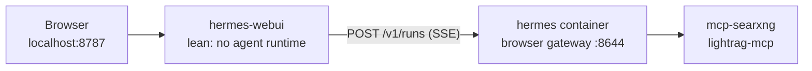

[← Back to README](../README.md)

# Hermes WebUI

A conventional chat UI for Hermes at `http://localhost:8787`, for when the dashboard's CLI-style console is the wrong shape for what you are doing.

The Hermes dashboard on port 9119 presents the agent as a terminal session. [Hermes WebUI](https://github.com/nesquena/hermes-webui) presents the same agent the way ChatGPT and Claude do: thread list in the sidebar, streaming replies, tool calls as collapsible cards instead of log lines. It talks to the Hermes you already have, so there is no second agent to run and no second set of model-server credentials to keep in sync.

Hermes WebUI is part of the default **`core`** profile (with Hermes and SearXNG).

## Architecture

The WebUI container holds no agent runtime at all. Browser turns are forwarded over the compose network to a `browser` gateway inside the existing `hermes` container, which means tools, MCP sidecars, skills, and the `/opt/projects` mounts all execute where they already work.



That routing is why the addition stays small. `HERMES_WEBUI_CHAT_BACKEND=gateway` sends chat through `api/gateway_chat.py`, which imports only the standard library plus WebUI-local modules. Since the agent is never imported, its source never has to be present. The container comes in around 133 MB, and its startup install is three small pure-Python packages.

There is also exactly one place where turns actually run. Configure a new MCP server, a skill, or a mount for the agent and the browser picks it up automatically; when something breaks, you only have one container to look in.

How the agent *talks* is the `browser` profile's `SOUL.md`
(`data/hermes/profiles/browser/SOUL.md`), not the dashboard copy and not the
`write-in-voice` skill. Memories are shared across profiles; soul is not. See
[Conversational tone](hermes.md#conversational-tone-soulmd).

## Enabling

Ensure `core` is in `.env`:

```bash
COMPOSE_PROFILES=core
```

Then:

```bash
docker compose up -d
```

Or per command, without touching `.env`:

```bash
docker compose --profile core up -d
```

Open `http://localhost:8787`. The port is bound to `127.0.0.1`, like every other service in this stack.

`./scripts/setup.sh` writes `compose/hermes/browser.env` with a generated key, so a normal setup needs nothing else. Setting it up by hand instead:

```bash
cp compose/hermes/browser.env.example compose/hermes/browser.env
# then set API_SERVER_KEY to a fresh secret:
openssl rand -hex 32
```

Use a **different** key from `compose/hermes/api-server.env`. Hermes scopes API keys per profile and rejects a key presented to a profile it was not issued for. Share one key across both and every message comes back 401.

## The `browser` profile

Browser chat does not reuse the `api-server` profile, which is tuned for unattended callers like n8n: a low turn cap so a runaway loop cannot bill forever, and a toolset with the interactive tools stripped out. Both settings are wrong when a human is sitting in front of it.

So a second one-shot service, `hermes-browser-bootstrap`, creates a `browser` profile from the same script:

| Setting | `api-server` | `browser` |
|---|---|---|
| Port | 8643 (published) | **8644 (internal only)** |
| Max tool turns | 20 | **60** (`HERMES_BROWSER_MAX_TURNS`) |
| Toolset | `hermes-api-server` | **`hermes-cli`** |
| Callers | n8n, curl, scripts | Hermes WebUI only |

The turn cap goes up because someone is watching and can press Stop; cutting off a genuinely long task at 20 turns does more damage than letting it run. The toolset is the full CLI set precisely because the interactive-only tools matter here. `clarify` is the one that earns its keep, turning an ambiguous request into a question instead of a confident guess.

Port 8644 is **not** published to the host. Only the WebUI talks to it, at `http://hermes:8644` over the compose network.

One thing the `browser` profile does **not** get is a looser LightRAG allowlist. The five-tool read-only filter carries over from `api-server` unchanged, because 12 of that server's 17 tools mutate the knowledge graph and having a human in the loop is a poor reason to expose `delete_by_entities`.

Keeping that true takes an extra step. Profiles are created with `profile create --clone`, so they inherit the default profile's MCP servers. The stack ships LightRAG on the default profile unfiltered, as `lightrag-mcp`, for dashboard and CLI use; the clone therefore arrives carrying both that entry and the filtered `lightrag` one, both pointing at the same server. All 17 tools come back through the unfiltered copy and the allowlist stops meaning anything. The bootstrap drops the duplicate and logs it:

```text
Removed unfiltered duplicate MCP server 'lightrag-mcp' (...) - 'lightrag' already exposes it, restricted to 5 tools
```

That removal is narrowly gated: only profiles the bootstrap manages, only on a URL match, and only when the duplicate carries no allowlist of its own. Your default profile is left exactly as you configured it, and a duplicate you filtered yourself reads as intentional and stays.

Re-apply after changing `browser.env` or `HERMES_BROWSER_MAX_TURNS` (one-shot containers do not re-run on every `up`):

```bash
docker compose run --rm hermes-browser-bootstrap
docker compose restart hermes
```

Do not skip the `restart hermes`. `cont-init.d/02-reconcile-profiles` reads each profile's `gateway_state.json` **once at container start**, so a profile created while `hermes` is already running has no gateway until the next boot.

## What lean mode trades away

Running without the agent source costs you:

- **The model picker.** In gateway mode the model comes from the `browser` profile's `config.yaml` anyway, so the dropdown would offer a choice it cannot honor. Change models with `docker compose exec hermes hermes -p browser config set ...` instead.
- **CLI session import.** You cannot pull an existing terminal `hermes` conversation into the browser.
- **Profile management from the UI.** Use the `hermes` CLI, as documented in [docs/hermes.md](hermes.md).

The expected consequence in the logs, on every start:

```text
!! WARNING: hermes-agent source not found.
!! The WebUI will start with reduced functionality (no model auto-detection, ...)
```

That line is expected on a lean install. Worry about it only if you were going for full parity.

The same missing source trips the first-run wizard. It decides "chat ready" by importing `run_agent` *inside the WebUI container*, so it labels the agent "Missing or partially importable" and the already-saved model config "Saved but incomplete". Chat works fine through the gateway; the wizard is looking in the wrong container. `HERMES_WEBUI_SKIP_ONBOARDING=1` on the compose service marks onboarding complete unconditionally and stops the wizard from rewriting `config.yaml` / `.env`. Do not click through Provider setup on a lean install — that path writes credentials for a local agent the WebUI does not have.

Buying parity back is a one-line change: mount the agent source into the WebUI container at `/home/hermeswebui/.hermes/hermes-agent`. The bill arrives afterwards. The entrypoint then runs `uv pip install -e '<src>[all]'` on every start, which takes minutes and wants a `/app/venv` volume to avoid repeating itself, and you inherit a second copy of the agent's dependency tree to keep compatible with the first. Start lean. Add the mount if you find yourself actually missing the picker.

## Memory

`HERMES_WEBUI_AGENT_CACHE_MAX=5` (default 25) is the biggest lever on the WebUI's resident memory, since each cached agent pins a full transcript. The service is capped at 512M and the default does not fit in that.

That is RAM, not agent memory. Durable facts, past-chat search, and curated notes are documented in [Memory](memory.md) and [Hermes Agent](hermes.md#memory). Chat tone is [SOUL.md](hermes.md#conversational-tone-soulmd) on this same `browser` profile. WebUI chat runs on the `browser` gateway, so `session_search` from the WebUI does not see dashboard/CLI transcripts.

Enabling the WebUI also raises the `hermes` container's own limit from 2G to 3G, since it now supervises a third gateway process (default, `api-server`, `browser`), each with its own loaded toolset and MCP clients.

Heavy optional extras (`edge-tts`, `psutil`, Office document parsers) are left uninstalled on purpose. Those routes return HTTP 503 with an install hint.

## Upgrading

**Always upgrade both images together.** The WebUI reads the agent's on-disk state layout and imports agent modules directly, and the two are only tested against each other within a release window. Bumping one alone is the exact failure this setup guards against, which is why both tags sit adjacent in `.env` behind a single command:

```bash
make hermes-upgrade AGENT=v2026.9.1 WEBUI=0.53.12
```

That rewrites both tags, pulls, re-runs both profile bootstraps (a new agent may add config keys the running profiles lack), and recreates both containers. Run the verification block below afterwards. Tool filters and `skills.external_dirs` are the two settings that regress without announcing it.

Picking tags:

- **Agent** — [Docker Hub tags](https://hub.docker.com/r/nousresearch/hermes-agent/tags), e.g. `v2026.8.3`.
- **WebUI** — [GitHub releases](https://github.com/nesquena/hermes-webui/releases). Stable `vX.Y.Z` tags land roughly weekly; `exp-vX.Y.Z` prereleases land several times a day. Track stable, and watch out that the **image tag drops the leading `v`**: release `v0.52.106` is image `0.52.106`.

Neither image should track `latest`. This stack ran `hermes-agent:latest` once, and the locally cached layer drifted to a build that no published tag pointed at anymore, which left "what version broke this" with no answer.

## Verification

```bash
docker compose up -d          # with COMPOSE_PROFILES=core
docker compose ps hermes hermes-webui

# Both pins are in effect (never `latest`)
docker compose config | grep -E "image: (nousresearch/hermes-agent|ghcr.io/nesquena)"

curl -sf http://localhost:8787/health && echo "webui ok"

# Gateway mode is actually on, and not falling back to an in-process agent
curl -sf http://localhost:8787/api/health/agent | grep -o '"gateway_chat".*' | head -c 300

# The browser profile exists, with the looser turn cap and its own gateway
docker compose exec hermes hermes -p browser config get agent.max_turns   # 60

# Must list exactly: searxng "2 selected", lightrag "5 selected".
# An extra unfiltered `lightrag-mcp` row showing "all" means the inherited
# duplicate survived and the read-only allowlist no longer bounds anything.
docker compose exec hermes hermes -p browser mcp list

# The browser gateway is listening in-network — and is NOT published to the host
docker compose exec hermes-webui curl -sf http://hermes:8644/health && echo "browser gateway reachable"
curl -sf --max-time 3 http://localhost:8644/health || echo "expected: 8644 not published"

# Lean mode confirmed. This warning is expected; see "What lean mode trades away"
docker compose logs hermes-webui | grep -F "hermes-agent source not found"

# The WebUI ran as the right user — a mismatch here rewrites data/projects ownership
docker compose logs hermes-webui | grep -E "WANTED_(UID|GID)"
```

Then send a message in the browser that forces a tool call, for example:

> read the README in the career project

Confirm the tool card renders and the file resolves under `/opt/projects`. That proves execution landed in the `hermes` container with its mounts rather than in the WebUI.

## Troubleshooting

**First-run wizard says Hermes Agent is "Missing or partially importable".** Expected on a lean install. The wizard checks for `run_agent` inside the WebUI container, and gateway mode never has it. `HERMES_WEBUI_SKIP_ONBOARDING=1` (already set on the compose service) suppresses the wizard. Skip Provider setup, which would write credentials for a local agent that is not there. If an old tab still shows the modal after you recreate `hermes-webui`, reload it.

**Every message fails with a 401 / "Gateway rejected the WebUI API key".** `compose/hermes/browser.env` and the `browser` profile disagree. The bootstrap copies the key into the profile, so re-run it and restart:

```bash
docker compose run --rm hermes-browser-bootstrap && docker compose restart hermes
```

**Messages hang, then fail.** The `browser` gateway is not running. Usually the profile was created while `hermes` was already up, so the boot-time reconciler never saw it; `docker compose restart hermes` fixes that. Confirm with `docker compose exec hermes-webui curl -sf http://hermes:8644/health`.

**`hermes-webui` will not start, complaining about `browser.env`.** The file is a bind-mount source, and when it does not exist Docker helpfully creates a *directory* with that name. Remove the directory, then `cp compose/hermes/browser.env.example compose/hermes/browser.env` and set a key.

**Replies work but no tool ever runs.** Check whether the toolset actually applied. `docker compose exec hermes hermes -p browser config get platform_toolsets.api_server` should be a YAML list containing `hermes-cli`. If it reads back as a quoted string, the bootstrap's list writer did not run.
