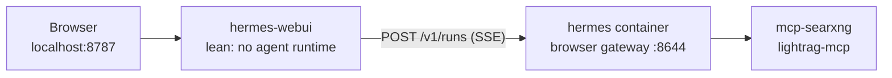

[← Back to README](../README.md)

# Hermes WebUI

A conventional chat UI for Hermes on `http://localhost:8787` — the familiar alternative to the dashboard's CLI-style console.

The Hermes dashboard on port 9119 presents the agent as a terminal session. [Hermes WebUI](https://github.com/nesquena/hermes-webui) presents the same agent the way ChatGPT and Claude do: a thread list in the sidebar, streaming replies, and tool calls as collapsible cards instead of log lines. It talks to the Hermes you already have — no second agent, no second set of credentials to the model server.

Hermes WebUI is part of the default **`core`** profile (with Hermes and SearXNG).

## Architecture

The WebUI container holds no agent runtime. Every browser turn is forwarded over the compose network to a `browser` gateway inside the existing `hermes` container, so tools, MCP sidecars, skills, and the `/opt/projects` mounts all execute where they already work.



This is what keeps the addition small. `HERMES_WEBUI_CHAT_BACKEND=gateway` routes chat through `api/gateway_chat.py`, which imports only the standard library plus WebUI-local modules — the agent is never imported, so the agent source never has to be present. The container is about 133 MB and its startup install is three small pure-Python packages.

It also means there is exactly one place where turns actually run. Anything you configure for the agent — a new MCP server, a skill, a mount — reaches the browser automatically, and anything that breaks there breaks in one place.

## Enabling

Ensure `core` is in `.env`:

```bash
COMPOSE_PROFILES=core
```

Then:

```bash
docker compose up -d
```

Or per command, without touching `.env`:

```bash
docker compose --profile core up -d
```

Open `http://localhost:8787`. The port is bound to `127.0.0.1`, like every other service in this stack.

`./scripts/setup.sh` writes `compose/hermes/browser.env` with a generated key, so a normal setup needs nothing else. Setting it up by hand instead:

```bash
cp compose/hermes/browser.env.example compose/hermes/browser.env
# then set API_SERVER_KEY to a fresh secret:
openssl rand -hex 32
```

Use a **different** key from `compose/hermes/api-server.env`. Hermes scopes API keys per profile and rejects a key presented to a profile it was not issued for, so sharing one key is not a shortcut — it is a gateway that returns 401 on every message.

## The `browser` profile

Browser chat does not reuse the `api-server` profile. That profile is deliberately tuned for unattended callers like n8n — a low turn cap so a runaway loop cannot bill forever, and a toolset with the interactive tools removed. Both are wrong when a human is sitting in front of it.

So a second one-shot service, `hermes-browser-bootstrap`, creates a `browser` profile from the same script:

| Setting | `api-server` | `browser` |
|---|---|---|
| Port | 8643 (published) | **8644 (internal only)** |
| Max tool turns | 20 | **60** (`HERMES_BROWSER_MAX_TURNS`) |
| Toolset | `hermes-api-server` | **`hermes-cli`** |
| Callers | n8n, curl, scripts | Hermes WebUI only |

The turn cap is higher because someone is watching and can press Stop; truncating a genuinely long task at 20 turns is the worse failure. The toolset is the full CLI set because the interactive-only tools are the point here — `clarify` in particular is what turns an ambiguous request into a question instead of a confident guess.

Port 8644 is **not** published to the host. Only the WebUI talks to it, at `http://hermes:8644` over the compose network.

What the `browser` profile does **not** get is a looser LightRAG allowlist. The five-tool read-only filter stays exactly as it is on `api-server`: 12 of that server's 17 tools mutate the knowledge graph, and interactive use is not a reason to expose `delete_by_entities`. Deleting your knowledge graph by accident is not more acceptable because you were watching it happen.

Keeping that true takes one extra step, because profiles are created with `profile create --clone` and inherit the default profile's MCP servers. If you have added LightRAG to the default profile unfiltered — the stack ships it that way as `lightrag-mcp`, for dashboard and CLI use — the clone arrives with both that entry and the filtered `lightrag` one, pointing at the same server. The unfiltered copy re-exposes all 17 tools and the allowlist becomes decorative. So the bootstrap drops it, logging:

```text
Removed unfiltered duplicate MCP server 'lightrag-mcp' (...) - 'lightrag' already exposes it, restricted to 5 tools
```

This only touches profiles the bootstrap manages, only when the URL matches, and only when the duplicate has no allowlist of its own. Your default profile is left exactly as you configured it, and a duplicate you filtered yourself is treated as deliberate and kept.

Re-apply after changing `browser.env` or `HERMES_BROWSER_MAX_TURNS` (one-shot containers do not re-run on every `up`):

```bash
docker compose run --rm hermes-browser-bootstrap
docker compose restart hermes
```

The `restart hermes` is required, not tidiness: `cont-init.d/02-reconcile-profiles` reads each profile's `gateway_state.json` **once at container start**. A profile created while `hermes` is already running has no gateway until the next boot.

## What lean mode trades away

Running without the agent source costs three things:

- **The model picker.** In gateway mode the model comes from the `browser` profile's `config.yaml` anyway, so the dropdown would be showing you a choice it cannot honor. Change models with `docker compose exec hermes hermes -p browser config set ...`.
- **CLI session import.** You cannot pull an existing terminal `hermes` conversation into the browser.
- **Profile management from the UI.** Use the `hermes` CLI, as documented in [docs/hermes.md](hermes.md).

The expected consequence in the logs, on every start:

```text
!! WARNING: hermes-agent source not found.
!! The WebUI will start with reduced functionality (no model auto-detection, ...)
```

That line is normal here. It is not normal if you *wanted* full parity.

The same missing source also trips the first-run wizard: it decides "chat ready" by importing `run_agent` *inside the WebUI container*, then labels the agent "Missing or partially importable" and the already-saved model config "Saved but incomplete". Chat still works through the gateway — the wizard is just looking in the wrong place. `HERMES_WEBUI_SKIP_ONBOARDING=1` on the compose service marks onboarding complete unconditionally and blocks the wizard from rewriting `config.yaml` / `.env`. Do not click through Provider setup in the wizard on a lean install; that path is for writing credentials into a local agent the WebUI does not have.

Buying parity back is a one-line change — mount the agent source into the WebUI container at `/home/hermeswebui/.hermes/hermes-agent` — but it is not free: the entrypoint then runs `uv pip install -e '<src>[all]'` on every start (minutes, and it wants a `/app/venv` volume to not repeat it), and you end up maintaining a second copy of the agent's dependency tree that has to stay compatible with the first. Start lean; add the mount if you find yourself actually missing the picker.

## Memory

`HERMES_WEBUI_AGENT_CACHE_MAX=5` (default 25) is the dominant lever on the WebUI's resident memory, because each cached agent pins a full transcript. The service is capped at 512M, which the default would not fit.

Enabling the WebUI also raises the `hermes` container's own limit from 2G to 3G, since it now supervises a third gateway process (default, `api-server`, `browser`), each with its own loaded toolset and MCP clients.

Optional heavy extras (`edge-tts`, `psutil`, Office document parsers) are deliberately not installed. Those routes return HTTP 503 with an install hint rather than failing quietly.

## Upgrading

**Always upgrade both images together.** The WebUI reads the agent's on-disk state layout and imports agent modules directly; the two are only tested against each other within a release window. Bumping one alone is the failure this is set up to prevent, which is why both tags sit adjacent in `.env` and there is a single command:

```bash
make hermes-upgrade AGENT=v2026.9.1 WEBUI=0.53.12
```

That rewrites both tags, pulls, re-runs both profile bootstraps (a new agent may add config keys the running profiles lack), and recreates both containers. Then run the verification block below — the tool filters and `skills.external_dirs` are what regress silently.

Picking tags:

- **Agent** — [Docker Hub tags](https://hub.docker.com/r/nousresearch/hermes-agent/tags), e.g. `v2026.8.3`.
- **WebUI** — [GitHub releases](https://github.com/nesquena/hermes-webui/releases). Two channels ship: `vX.Y.Z` stable (roughly weekly) and `exp-vX.Y.Z` prereleases (several per day). Track stable, and note the **image tag drops the leading `v`** — release `v0.52.106` is image `0.52.106`.

Neither image should track `latest`. That is not a style preference: this stack previously ran `hermes-agent:latest` and the locally cached layer had drifted to a build that no published tag pointed at anymore, which makes "what version broke this" unanswerable.

## Verification

```bash
docker compose up -d          # with COMPOSE_PROFILES=core
docker compose ps hermes hermes-webui

# Both pins are in effect (never `latest`)
docker compose config | grep -E "image: (nousresearch/hermes-agent|ghcr.io/nesquena)"

curl -sf http://localhost:8787/health && echo "webui ok"

# Gateway mode is actually on, not silently falling back to an in-process agent
curl -sf http://localhost:8787/api/health/agent | grep -o '"gateway_chat".*' | head -c 300

# The browser profile exists, with the looser turn cap and its own gateway
docker compose exec hermes hermes -p browser config get agent.max_turns   # 60

# Must list exactly: searxng "2 selected", lightrag "5 selected".
# An extra unfiltered `lightrag-mcp` row showing "all" means the inherited
# duplicate survived and the read-only allowlist is not a boundary.
docker compose exec hermes hermes -p browser mcp list

# The browser gateway is listening in-network — and is NOT published to the host
docker compose exec hermes-webui curl -sf http://hermes:8644/health && echo "browser gateway reachable"
curl -sf --max-time 3 http://localhost:8644/health || echo "expected: 8644 not published"

# Lean mode confirmed. This warning is expected; see "What lean mode trades away"
docker compose logs hermes-webui | grep -F "hermes-agent source not found"

# The WebUI ran as the right user — a mismatch here rewrites data/projects ownership
docker compose logs hermes-webui | grep -E "WANTED_(UID|GID)"
```

Then send a message in the browser that forces a tool call, for example:

> read the README in the career project

Confirm the tool card renders and the file resolves under `/opt/projects`. That is the check that matters: it proves execution landed in the `hermes` container with its mounts, not in the WebUI.

## Troubleshooting

**First-run wizard says Hermes Agent is "Missing or partially importable".** Expected on a lean install. The wizard checks for `run_agent` inside the WebUI container; gateway mode never has it. `HERMES_WEBUI_SKIP_ONBOARDING=1` (already set on the compose service) suppresses the wizard. Do not walk through Provider setup — that would write credentials for a local agent that is not there. Reload after recreating `hermes-webui` if an old tab still shows the modal.

**Every message fails with a 401 / "Gateway rejected the WebUI API key".** `compose/hermes/browser.env` and the `browser` profile disagree. The bootstrap copies the key into the profile, so re-run it and restart:

```bash
docker compose run --rm hermes-browser-bootstrap && docker compose restart hermes
```

**Messages hang, then fail.** The `browser` gateway is not running. Most often the profile was created while `hermes` was already up, so the boot-time reconciler never saw it — `docker compose restart hermes`. Confirm with `docker compose exec hermes-webui curl -sf http://hermes:8644/health`.

**`hermes-webui` will not start, complaining about `browser.env`.** The file is a bind-mount source. If it does not exist, Docker creates a *directory* with that name instead of failing usefully. Remove the directory, then `cp compose/hermes/browser.env.example compose/hermes/browser.env` and set a key.

**Replies work but no tool ever runs.** Check the toolset actually applied — `docker compose exec hermes hermes -p browser config get platform_toolsets.api_server` should be a YAML list containing `hermes-cli`. If it reads as a quoted string, the bootstrap's list writer did not run.
