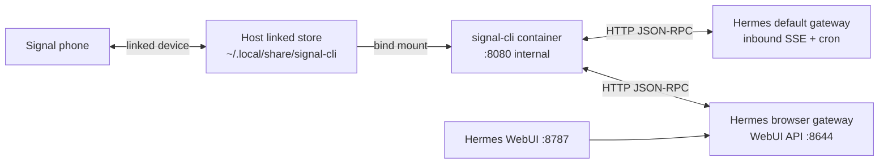

[← Back to README](../README.md)

# Signal messaging

Hermes can receive Signal messages, reply in chat, deliver cron output, and send from WebUI via a compose-managed [`signal-cli`](https://github.com/AsamK/signal-cli) HTTP daemon (native `daemon --http`, **not** [`signal-cli-rest-api`](https://github.com/bbernhard/signal-cli-rest-api)).

Enable with the **`signal`** profile (paired with **`core`**). The toggle is `HERMES_SIGNAL_ENABLED` in root `.env`; `make ensure-local` syncs `COMPOSE_PROFILES` and seeds Hermes env files.

```bash
HERMES_SIGNAL_ENABLED=1
make ensure-local
make up
```

See also: [Hermes Agent](hermes.md) (gateways, WebUI, cron), [Buzz](buzz.md) (Nostr workspace; no sidecar), [SECURITY.md](../SECURITY.md) (signal-cli has no HTTP auth — keep it compose-internal).

## Architecture



| Component | Role |
|---|---|
| **Host link** | One-time `signal-cli link` on the Mac/Linux host; session data lives under `SIGNAL_CLI_DATA_DIR` (default `~/.local/share/signal-cli`). |
| **`signal-cli` service** | Runs the daemon in Docker; mounts the host store; reachable only on the compose network as `http://signal-cli:8080`. |
| **Default Hermes profile** | Holds the Signal **SSE lock** — receives inbound messages and runs cron jobs created on the default profile. |
| **Browser Hermes profile** | Powers [WebUI](hermes-webui.md). Signal **adapter is disabled** (`platforms.signal.enabled: false`) so it does not fight the default gateway for the phone lock (a `--replace` handoff can tear down the whole WebUI gateway). Outbound WebUI `send_message` and **WebUI cron delivery** use `SIGNAL_*` env plus cont-init patches (same outbound-only model). |

Upstream Hermes intentionally leaves `send_message` unregistered as an agent tool. This stack re-registers it for WebUI and ensures it stays in the live tool schema (see [Troubleshooting](#troubleshooting)).

## Prerequisites

1. Install `signal-cli` on the **host** (Java 17+). On macOS: `brew install signal-cli`.
2. Link once from the host:

   ```bash
   signal-cli link -n "HermesAgent"
   ```

   Scan the QR from Signal → Settings → Linked Devices.

3. **Stop any host `signal-cli daemon`** before starting the compose service. Only **one** process may receive for the linked account.

## Configuration

### Where env vars live

| File | Purpose |
|---|---|
| Root `.env` | Toggle + Compose: `HERMES_SIGNAL_ENABLED`, `SIGNAL_ACCOUNT`, `SIGNAL_ALLOWED_USERS`, `SIGNAL_HOME_CHANNEL`, `SIGNAL_CLI_DATA_DIR`, `SIGNAL_CLI_IMAGE`, `SIGNAL_CLI_UID` / `SIGNAL_CLI_GID` |
| `data/hermes/.env` | Default gateway — inbound Signal + cron delivery |
| `data/hermes/profiles/browser/.env` | WebUI / `browser` profile — same `SIGNAL_*` for outbound send and cron delivery |

Do **not** put Signal settings in `compose/hermes/api-server.env` or `browser.env`.

### Enable

In root `.env`:

```bash
HERMES_SIGNAL_ENABLED=1
SIGNAL_ACCOUNT=+15551234567          # E.164 — your linked number or bot number
SIGNAL_ALLOWED_USERS=+15551234567    # who may DM the bot (comma-separated)
SIGNAL_HOME_CHANNEL=+15551234567   # Note to Self — default send + cron/WebUI delivery target
# Optional; sync defaults to $HOME/.local/share/signal-cli:
# SIGNAL_CLI_DATA_DIR=/Users/you/.local/share/signal-cli
```

Then sync and start:

```bash
make ensure-local    # or: ./scripts/sync-signal-profile.sh
make up
```

`ensure-local` also sets `SIGNAL_CLI_UID` / `SIGNAL_CLI_GID` from your host user so the container can read the linked store.

Hermes reaches the daemon at `http://signal-cli:8080` on the compose network. There is **no host publish** (SearXNG already binds host `:8080`).

On a **fresh install**, `make up` applies cont-init patches automatically. If you change Signal env on an **already-running** stack, recreate Hermes so both gateways reload dotenv:

```bash
docker compose up -d --force-recreate hermes
```

### Disable

```bash
# In .env
HERMES_SIGNAL_ENABLED=0
make ensure-local
docker compose up -d   # or: docker compose stop signal-cli
```

Sync removes `signal` from `COMPOSE_PROFILES` and clears seeded `SIGNAL_*` keys from `data/hermes/.env` and `data/hermes/profiles/browser/.env`.

## Verify

**Daemon and gateway**

```bash
make doctor                    # Signal section when enabled
docker compose ps signal-cli
# Body may be empty; HTTP 200 is enough:
docker compose exec hermes curl -sf http://signal-cli:8080/api/v1/check && echo "signal-cli ok"
docker compose logs hermes | grep -i signal
```

**CLI send (no LLM)**

```bash
docker compose exec hermes hermes send --to signal "test from CLI"
docker compose exec hermes hermes send --list              # default profile
docker compose exec hermes hermes -p browser send --list   # browser profile
```

Note: `hermes -p browser send --list` may show “no platforms configured” because the browser adapter is intentionally disabled. CLI send and WebUI `send_message` still use synthesized credentials from env.

**Inbound**

From your phone, send Note to Self (same linked number) or a DM to an allowed user. Hermes should reply on the default gateway.

**WebUI outbound**

Open a **new** WebUI chat and ask the agent to send on Signal, e.g.:

> Call `send_message` with target `signal` and message "WebUI Signal test".

Use a fresh thread after Hermes recreate so tool lists are not stale in context.

**Cron (WebUI and browser profile)**

Jobs scheduled from WebUI chat deliver to Signal automatically when `SIGNAL_HOME_CHANNEL` is set — no need to specify `deliver: signal` in chat. Existing jobs with `deliver=origin` also fall back to Signal after the stack patches apply.

Smoke test on the browser profile:

```bash
docker compose exec hermes hermes -p browser cron create \
  --name "signal-cron-smoke" --schedule "every 1m" \
  --prompt "Reply with exactly: cron signal ok" --deliver signal --once
docker compose exec hermes hermes -p browser cron run <job-id>
# Expect a Signal message; then delete the job
```

Cron jobs created from the CLI on the **default** profile also use `deliver: signal` when configured. See [Hermes cron](hermes.md).

## Troubleshooting

| Symptom | Likely cause | Fix |
|---|---|---|
| `signal-cli` unhealthy or HTTP check fails | Host daemon still running, or bad mount/UID | Stop host `signal-cli daemon`; check `SIGNAL_CLI_DATA_DIR` exists and `SIGNAL_CLI_UID`/`GID` match ownership; `make doctor` |
| Inbound works, WebUI cannot send | Browser adapter disabled by design | Expected — outbound uses env + patches, not browser SSE; recreate Hermes after env changes |
| Agent says “no send_message tool” | Stale tool schema or model only searched MCP catalog | `docker compose up -d --force-recreate hermes`; new WebUI chat; ask to call `send_message` directly (not only `tool_search`) |
| Agent lists tools without `send_message` | Gateway started before patches or stale tool-discovery cache | Recreate Hermes (cont-init clears cache and applies patches) |
| WebUI gateway dies after enabling Signal on browser profile | Both gateways held Signal SSE lock | Re-run `make ensure-local` — sync sets `platforms.signal.enabled: false` on browser |
| Corrupted `.env` / sync error about `=` in channel | Two keys mashed on one line | Fix line breaks in `.env` (e.g. `SIGNAL_HOME_CHANNEL=…` must not run into `SIGNAL_CLI_DATA_DIR=…`) |
| Cron fails with `api_server ... not send()` | WebUI origin cannot deliver; old image or missing patches | `docker compose up -d --force-recreate hermes`; re-run the job — delivery should land on Signal |
| WebUI cron never delivers | Missing `SIGNAL_HOME_CHANNEL` or browser env not seeded | Set `SIGNAL_HOME_CHANNEL` in root `.env`; `make ensure-local`; recreate Hermes |
| Empty body from `/api/v1/check` | Normal for some signal-cli versions | HTTP **200** is sufficient |

**Doctor**

```bash
make doctor
```

When Signal is enabled, doctor checks account, data dir, `COMPOSE_PROFILES`, `SIGNAL_HOME_CHANNEL`, seeded Hermes env, browser adapter pin, cron patch markers, container health, and HTTP reachability from `hermes`.

**Patches (maintainers)**

Applied at Hermes container start via `compose/hermes/04-patch-signal-send.sh`:

- `patch-send-message-tool.py` — Signal env synth when browser adapter is disabled + re-register `send_message` / core toolset membership
- `patch-ensure-send-message-tools.py` — force-import / ensure `send_message` in live tool definitions (stale discovery cache)
- `patch-tool-search-visible.py` — teach `tool_search` to surface already-visible core tools
- `patch-cron-scheduler-delivery.py` — reject undeliverable `api_server` origins + Signal env synth for cron delivery
- `patch-cron-default-deliver-signal.py` — default WebUI cron jobs to `deliver: signal` when `SIGNAL_HOME_CHANNEL` is set

After upgrading the Hermes image, verify WebUI send and cron delivery still work; patch snippets may need updating if upstream changes.

## Security

- Do not publish `signal-cli` `:8080` to the LAN — the HTTP API has **no authentication**. See [SECURITY.md](../SECURITY.md).
- Treat `SIGNAL_CLI_DATA_DIR` like a password (full account access).
- Keep `SIGNAL_ALLOWED_USERS` tight.
